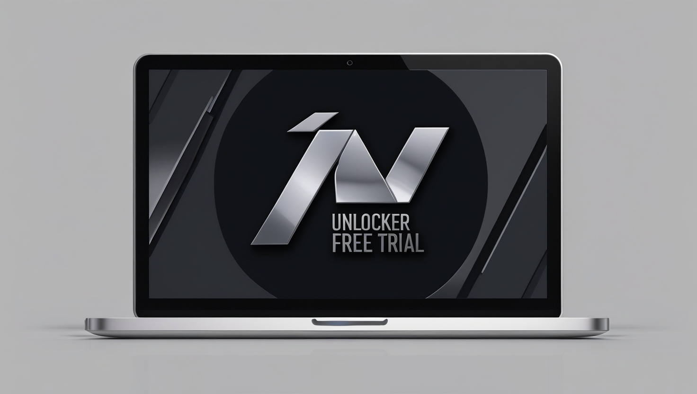
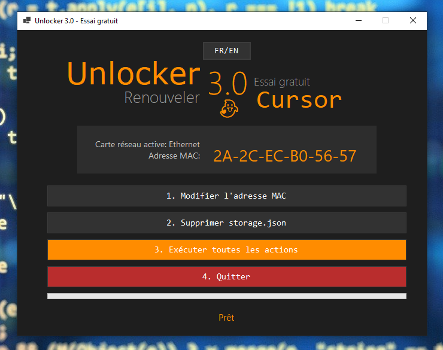

# 🔓 Unlocker Free Trial

<div align="center">


[](LICENSE)

*Application PowerShell élégante pour gérer les essais gratuits de Cursor. Version bilingue Français/Anglais.*

[🇫🇷 Français](#) | [🇬🇧 English](#) | [📖 Documentation](#) | [🐛 Issues](#)




</div>

## ✨ Fonctionnalités

- 🎨 Interface graphique moderne et intuitive (v2)
  - Nouveau design sombre avec accents orange
  - Barre de progression visuelle
  - Affichage en temps réel des actions
- 🔄 Changement d'adresse MAC des adaptateurs réseau
- 🗑️ Suppression du fichier storage.json
- 🌍 Version bilingue (FR/EN) avec changement de langue à la volée (v2)
- 🛡️ Mode administrateur automatique
- 📝 Logs détaillés pour le débogage

## 📋 Prérequis

- Windows 10 ou supérieur
- PowerShell 7 ou supérieur
- Droits administrateur

## 🚀 Installation rapide

```powershell
# Cloner le dépôt
git clone https://github.com/French-Team/Unlocker_Free_Trial.git

# Accéder au dossier
cd Unlocker_Free_Trial

## Démarrage de l'application

### Méthode recommandée : Utiliser le launcher

Pour une expérience optimale, utilisez toujours le fichier `launcher.bat` fourni pour démarrer l'application. Ce fichier permet de lancer l'application sans afficher la fenêtre console PowerShell.

1. Double-cliquez simplement sur `launcher.bat`
2. L'interface graphique s'ouvrira directement, sans fenêtre console visible

### Autres méthodes de lancement

Si vous lancez directement le fichier `start.ps1`, une fenêtre PowerShell apparaîtra brièvement avant que l'interface ne s'ouvre. Cette fenêtre est nécessaire pour exécuter le script mais peut être gênante visuellement.

Pour créer un raccourci personnalisé :
1. Cliquez-droit sur votre bureau → Nouveau → Raccourci
2. Dans le champ "Emplacement de l'élément", entrez :
   ```
   powershell.exe -WindowStyle Hidden -ExecutionPolicy Bypass -File "C:\chemin\complet\vers\start.ps1"
   ```
   (remplacez par le chemin réel vers votre fichier start.ps1)
3. Donnez un nom à votre raccourci et validez

### Note pour les développeurs

En mode développement, vous pouvez définir la variable d'environnement `TEST_MODE` pour garder la console visible et voir les logs : 

```powershell
$env:TEST_MODE = "true"
.\start.ps1
```

## 📁 Structure du projet

```
Unlocker_Free_Trial/
├── Step1_Start.ps1        # Point d'entrée et vérification des droits
├── Step2_Admin.ps1        # Gestion des droits administrateur
├── Step3_Interface.ps1    # Interface graphique (v2)
├── Step4_MacAddress.ps1   # Gestion des adresses MAC
├── Step5_FileManager.ps1  # Gestion des fichiers
├── Step6_ExecuteAll.ps1   # Exécution des actions
└── launcher.bat          # Lanceur sans console visible
```

## 🤝 Contribution

Les contributions sont les bienvenues ! Voici comment vous pouvez nous aider :

1. 🍴 Fork le projet
2. 🌿 Créez une branche (`git checkout -b feature/AmazingFeature`)
3. 🔧 Commit vos changements (`git commit -m 'Add: nouvelle fonctionnalité'`)
4. 📤 Push sur la branche (`git push origin feature/AmazingFeature`)
5. 🔍 Ouvrez une Pull Request

## 📜 Licence

Distribué sous la licence MIT. Voir `LICENSE` pour plus d'informations.

## 📞 Contact

French Team - french.team.ai@gmail.com

<div align="center">

[](https://github.com/French-Team/Unlocker_Free_Trial/stargazers)
[](https://github.com/French-Team)

*Made with ❤️ by French Team*

</div>


