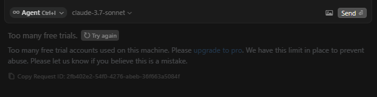
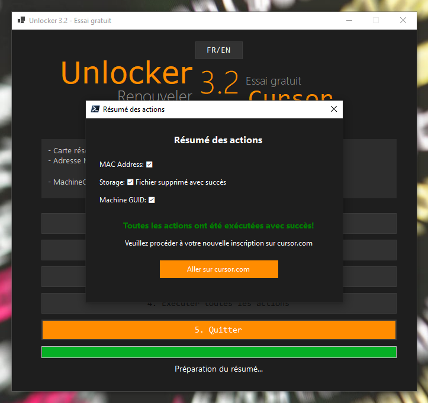

# 🔓 Unlocker 3.2 - Free Trial for Cursor


> Renouveler facilement les 3 essais gratuits dans Cursor

---


---


> A lire jusqu'a la fin pour trouver le Bonus "Claude 3.7 sonnet" en illimité.

***

<div align="center">


[](LICENSE)

*Application PowerShell élégante pour gérer les essais gratuits de Cursor. Version bilingue Français/Anglais.*

[🇫🇷 Français](#) | [🇬🇧 English](#) | [📖 Documentation](#) | [🐛 Issues](#)




</div>

## ✨ Fonctionnalités

- 🎨 Interface graphique moderne, intuitive et responsive (v3.2)
  - Design sombre avec accents orange
  - Barre de progression visuelle avec retour en temps réel
  - Affichage des informations réseau et registre en direct
  - Fenêtre modale de résumé après exécution
- 🔄 Gestion complète des modifications nécessaires :
  - Changement d'adresse MAC des adaptateurs réseau
  - Modification du MachineGuid dans le registre Windows
  - Suppression du fichier storage.json de Cursor
- 🚀 Exécution groupée de toutes les actions avec une seule commande
- 🌍 Version bilingue (FR/EN) avec changement de langue à la volée
- 🛡️ Mode administrateur automatique et sécurisé
- 📝 Logs détaillés pour le débogage en mode développeur
- 🧩 Architecture modulaire "Boutique" pour une maintenance facilitée

## 📋 Prérequis

- Windows 10 ou supérieur
- PowerShell 7 ou supérieur
- Droits administrateur

## 🚀 Installation rapide

```powershell
# Cloner le dépôt
git clone https://github.com/French-Team/Unlocker_Free_Trial.git

# Accéder au dossier
cd Unlocker_Free_Trial
```

## 📱 Utilisation

### Méthode recommandée : Utiliser le launcher

Pour une expérience optimale, utilisez toujours le fichier `launcher.bat` fourni pour démarrer l'application. Ce fichier permet de lancer l'application sans afficher la fenêtre console PowerShell.

```
1. Double-cliquez simplement sur `launcher.bat`
2. L'interface graphique s'ouvrira directement.
```

### Fonctionnalités principales

L'interface propose 5 options principales :


1. **Modifier l'adresse MAC** - Change l'adresse MAC de votre carte réseau active
2. **Supprimer storage.json** - Efface le fichier de stockage de Cursor contenant les informations d'essai
3. **Modifier MachineGuid** - Change l'identifiant unique de votre machine dans le registre Windows
4. **Exécuter toutes les actions** - Effectue les 3 opérations ci-dessus en séquence
5. **Quitter** - Ferme l'application


Un résumé des actions effectuées est affiché après l'exécution groupée.

### Mode développeur

En mode développement, vous pouvez définir la variable d'environnement `TEST_MODE` pour garder la console visible et voir les logs : 

```powershell
$env:TEST_MODE = "true"
.\start.ps1
```

## 📁 Structure du projet

```
Unlocker_Free_Trial/
├── launcher.bat                 # Lanceur sans console visible
├── start.ps1                    # Point d'entrée principal
├── Step1_AdminCheck.ps1         # Vérification des droits administrateur
├── Step2_UTF8.ps1               # Gestion de l'encodage
├── Step3_Interface.ps1          # Interface graphique principale
├── Step3_MacInfo.ps1            # Panneau d'informations MAC
├── Step3_NetworkInfoPanel.ps1   # Panneau d'informations réseau
├── Step4_MacAddress.ps1         # Gestion des adresses MAC
├── Step4_MacAddressGUI.ps1      # Interface pour modification MAC
├── Step5_FileManager.ps1        # Gestion des fichiers storage.json
├── Step6_ExecuteAll.ps1         # Exécution groupée des actions
├── Step7_RegistryManager.ps1    # Gestion du registre et MachineGuid
├── Step8_ProgressBar.ps1        # Gestion de la barre de progression
└── docs/                        # Documentation et ressources
```

## 🆕 Nouveautés de la version 3.2

- ✅ Ajout de la modification du MachineGuid 
- ✅ Nouvelle barre de progression avec retour visuel en temps réel
- ✅ Fenêtre de résumé des actions avec statut détaillé
- ✅ Architecture "Boutique" pour une meilleure modularité
- ✅ Optimisations de performance et corrections de bugs
- ✅ Support amélioré des différentes configurations réseau

## 🤝 Contribution

Les contributions sont les bienvenues ! Voici comment vous pouvez nous aider :

1. 🍴 Fork le projet
2. 🌿 Créez une branche (`git checkout -b feature/AmazingFeature`)
3. 🔧 Commit vos changements (`git commit -m 'Add: nouvelle fonctionnalité'`)
4. 📤 Push sur la branche (`git push origin feature/AmazingFeature`)
5. 🔍 Ouvrez une Pull Request

## 📜 Licence

Distribué sous la licence MIT. Voir `LICENSE` pour plus d'informations.

## 🔓 Extras: Débloquer/Unlocker la limitation dans Cursor de claude 3.7 Sonnet
```
* Supprimer "machineid" dans "C:\Users\<a changer>\AppData\Roaming\Cursor\machineid"
```

## 📞 Contact

French Team AI - french.team.ai@gmail.com

<div align="center">

[](https://github.com/French-Team/Unlocker_Free_Trial/stargazers)
[](https://github.com/French-Team)

*Made with ❤️ by French Team AI*

</div>


